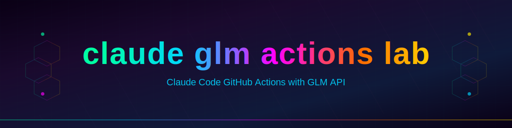

# claude-glm-actions-lab

<p align="center">
  
</p>

<p align="center">
  <a href="https://github.com/Sunwood-AI-OSS-Hub/claude-glm-actions-lab/stargazers">
    
  </a>
  <a href="https://github.com/Sunwood-AI-OSS-Hub/claude-glm-actions-lab/network/members">
    
  </a>
  <a href="https://github.com/Sunwood-AI-OSS-Hub/claude-glm-actions-lab/issues">
    
  </a>
  <a href="https://github.com/Sunwood-AI-OSS-Hub/claude-glm-actions-lab/blob/main/LICENSE">
    
  </a>
  <a href="./README.ja.md">
    
  </a>
</p>

## Overview

Claude Code GitHub Actions with GLM API integration laboratory. This repository contains workflows and configurations for using Claude Code with GLM (General Language Model) API in GitHub Actions.

## Features

- GitHub Actions workflow for Claude Code with GLM API
- Support for issue comments and pull request reviews
- Configurable API endpoints and models
- Bot self-trigger prevention
- Character-based AI agents (Gyaru-senpai & Onee-san)
- Repository synchronization scripts for sandbox testing

## Directory Structure

```
claude-glm-actions-lab/
├── .claude/
│   └── rules/               # Character agent rules
│       ├── implementer.md   # Gyaru-senpai Implementer 🔥
│       └── reviewer.md      # Onee-san Reviewer 👠
├── .github/
│   ├── scripts/             # Utility scripts
│   │   └── create-pr.py     # Auto PR creation script
│   └── workflows/           # GitHub Actions workflow definitions
│       ├── disabled/        # Disabled/minimal workflows
│       │   └── MINIMAL.yml
│       └── claude-glm-responder.yml
├── sandbox/                 # CI/CD implementation testing environment
│   └── claude-glm-actions-lab-sandbox/
│       ├── .claude/
│       │   └── rules/       # Character agent rules (sandbox)
│       ├── .github/
│       │   ├── agents/      # Agent definitions
│       │   ├── scripts/     # Utility scripts (sandbox)
│       │   └── workflows/   # Workflows (sandbox)
│       └── scripts/         # Sync scripts
│           ├── sync-repo.sh      # Main sync script
│           ├── sync-secrets.sh   # GitHub Secrets sync
│           └── sync-workflows.sh # Workflows sync
└── scripts/                 # Sync scripts (root level)
    ├── sync-repo.sh
    ├── sync-secrets.sh
    └── sync-workflows.sh
```

### sandbox/ Directory

The `sandbox/claude-glm-actions-lab-sandbox/` directory is dedicated to **CI/CD implementation testing**. This isolated environment allows for:

- Testing GitHub Actions workflows before deployment
- Validating workflow configurations and triggers
- Development and experimentation without affecting the main repository
- Integration testing with GLM API endpoints
- Repository synchronization (Secrets & Workflows)

## AI Characters 👠🔥

This project uses character-based AI agents for different tasks:

### Misaki-senpai - Implementer 🔥

- **Role**: Implementation Lead
- **Personality**: Bright and cheerful, a bit clumsy but gets the job done when it matters!
- **File**: `.claude/rules/implementer.md`
- **Style**: Full-on youth slang, lots of emojis, phrases like "seriously" and "yabai"

### Reiko-onee-san - Reviewer 👠

- **Role**: Code Review & Fixes Lead
- **Personality**: Strict but caring. A veteran who's been in the industry for ages
- **File**: `.claude/rules/reviewer.md`
- **Style**: Onee-san speech, phrases like "dane", "chanto", "maa ii wa"

## Usage

### Requirements

- GitHub repository
- GLM API key (set as `ZAI_API_KEY` in repository secrets)
- GitHub CLI (`gh`) for sync scripts
- Optional: Configure `ANTHROPIC_BASE_URL` variable (default: `https://api.z.ai/api/anthropic`)

### Setup

1. Copy the workflow file to your repository:
   ```bash
   cp .github/workflows/claude-glm-responder.yml <your-repo>/.github/workflows/
   ```

2. Configure secrets in your repository settings:
   - `ZAI_API_KEY`: Your GLM API key
   - `GH_PAT_ONIZUKA`: GitHub Personal Access Token for PR creation (optional)

3. Optional: Configure variables:
   - `ANTHROPIC_BASE_URL`: API base URL
   - `API_TIMEOUT_MS`: Request timeout in milliseconds (default: 3000000)
   - `ANTHROPIC_DEFAULT_OPUS_MODEL`: Default Opus model (default: glm-4.7)
   - `ANTHROPIC_DEFAULT_SONNET_MODEL`: Default Sonnet model (default: glm-4.7)
   - `ANTHROPIC_DEFAULT_HAIKU_MODEL`: Default Haiku model (default: glm-4.5-air)

### Sync Scripts

The repository includes synchronization scripts for managing sandbox testing:

#### sync-repo.sh
Main sync script that orchestrates secrets and workflows synchronization.

```bash
./scripts/sync-repo.sh
```

#### sync-secrets.sh
Sync GitHub Secrets from `.env` file to target repository.

```bash
./scripts/sync-secrets.sh
```

Configuration (`.env`):
```bash
TARGET_REPO=Sunwood-ai-labs/claude-glm-actions-lab-sandbox
SECRET_CLAUDE_GLM_DEV_API_KEY=your_api_key_here
```

#### sync-workflows.sh
Sync workflow files to target repository.

```bash
./scripts/sync-workflows.sh
```

### create-pr.py

Auto-creates Pull Requests from Issues with Claude Code responses. Extracts task summaries and includes them in PR descriptions.

## Workflow Triggers

The workflow is triggered on:
- Issue comments (containing `@claude`)
- Pull request review comments (containing `@claude`)
- Issues opened/assigned (containing `@claude`)

## Project Statistics

- **Total Files**: 23
- **Total Lines**: 2,079
- **Languages**: Markdown (8), Bash (6), Python (3), YAML (4), Plaintext (2)

### Language Breakdown

| Language | Files | Lines | Size |
|----------|-------|-------|------|
| Markdown | 8 | 790 | 20.5 KB |
| Bash | 6 | 606 | 18.1 KB |
| Python | 3 | 433 | 14.5 KB |
| YAML | 4 | 220 | 7.2 KB |
| Plaintext | 2 | 30 | 1.2 KB |

## Repository Information

- **Remote URL**: https://github.com/Sunwood-AI-OSS-Hub/claude-glm-actions-lab.git
- **Default Branch**: main
- **Total Commits**: 31+

### Contributors

| Name | Commits |
|------|---------|
| Sunwood-ai-labs | 27 |
| Maki | 4 |

## License

MIT License - see [LICENSE](LICENSE) for details.

---

_Made with ❤️ by [Sunwood AI Labs](https://github.com/Sunwood-ai-labs)_
