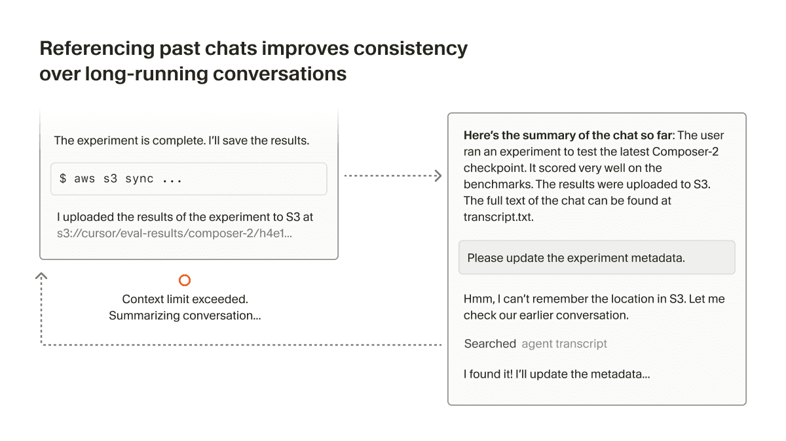
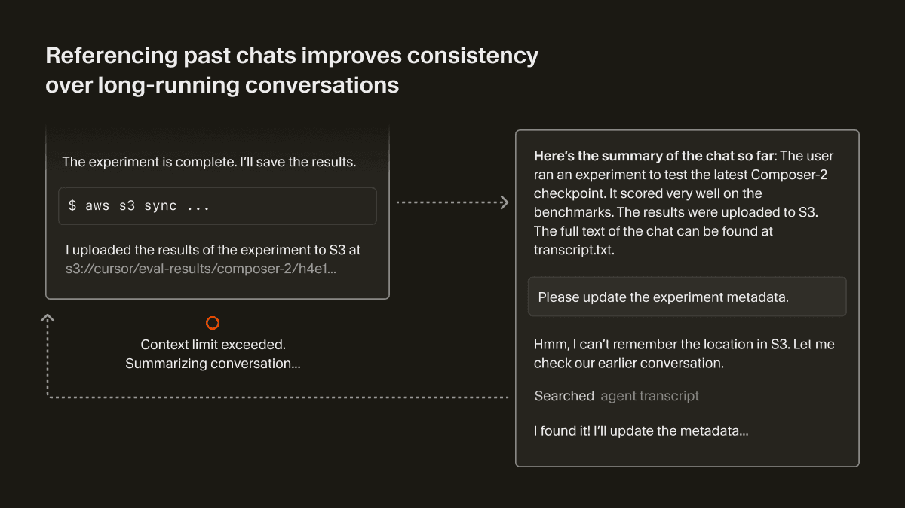
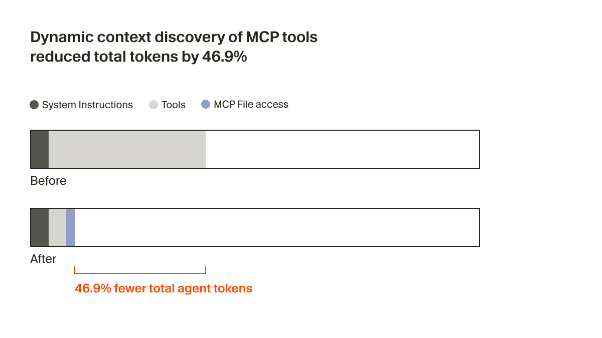
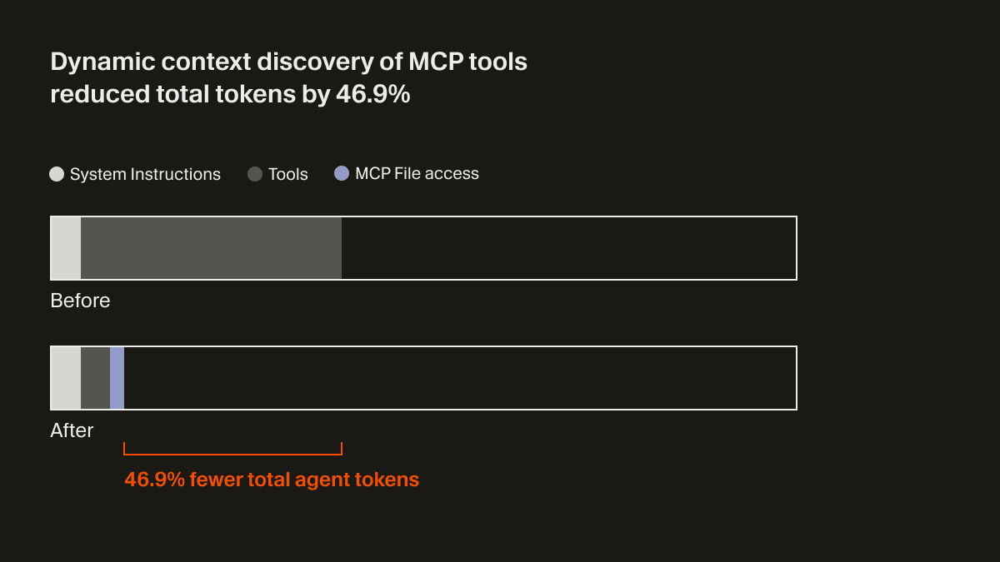

# 動的コンテキスト探索

コーディングエージェントは、ソフトウェアの開発方法を急速に変えつつあります。この急速な進歩は、エージェント指向のモデルの向上と、それらを適切に制御するためのコンテキストエンジニアリングの改善の両方によってもたらされています。

Cursor のエージェントハーネス、つまりモデルに与える指示とツールのセットは、サポートするあらゆる新しい最先端モデルごとに個別に最適化されています。一方で、コンテキストの収集方法や、長いインタラクション全体でのトークン使用の最適化など、ハーネス内のすべてのモデルに共通して適用できるコンテキストエンジニアリング上の改善余地もあります。

モデルがエージェントとしてより優秀になるにつれ、私たちは、最初に与える詳細を減らし、エージェントが自力で関連コンテキストを引き出しやすくすることで成果を上げてきました。私たちはこのパターンを、常に同じコンテキストを含める _static context_（静的コンテキスト）と対比して、**dynamic context discovery**（動的コンテキスト探索）と呼んでいます。

## 動的コンテキスト検出のためのファイル

動的コンテキスト検出は、必要なデータだけをコンテキストウィンドウに取り込むため、トークン効率が大幅に向上します。また、コンテキストウィンドウ内の紛らわしい情報や矛盾した情報を減らすことで、エージェントの応答品質向上にもつながります。

Cursor では、動的コンテキスト検出を次のように活用しています。

1. 長いツール応答をファイルに変換する
2. 要約時にチャット履歴を参照する
3. Agent Skills オープン標準をサポートする
4. 必要な MCP ツールだけを効率的に読み込む
5. すべての統合ターミナルセッションをファイルとして扱う

## 1. 長いツールレスポンスをファイルに出力する

ツール呼び出しは、大きな JSON レスポンスを返すことでコンテキストウィンドウを劇的に増大させてしまうことがあります。

Cursor におけるファイル編集やコードベース検索のようなファーストパーティツールでは、賢いツール定義や最小限のレスポンス形式によってコンテキストの肥大化を防げますが、サードパーティツール（例: シェルコマンドや MCP コール）は、そのままでは同様には扱えません。

一般的なコーディングエージェントが取るアプローチは、長いシェルコマンドの出力や MCP の結果を切り詰めることです。これは、コンテキストに含めたい重要な情報を失う可能性があります。Cursor では代わりに、出力をファイルに書き出し、そのファイルをエージェントが読めるようにします。エージェントは `tail` コマンドを呼び出して末尾を確認し、必要に応じてさらに読み進めます。

これにより、コンテキスト上限に達したときに発生する不要な要約処理が減少しました。

## 2. 要約中にチャット履歴を参照する

モデルのコンテキストウィンドウがいっぱいになると、Cursor は要約ステップを実行し、これまでの作業内容の要約を含んだ新しいコンテキストウィンドウをエージェントに与えます。

しかし、コンテキストを情報が失われる形で圧縮しているため、要約後にはエージェントの知識が劣化する可能性があります。エージェントは、自分のタスクに関する重要な詳細を忘れてしまっているかもしれません。Cursor では、要約の品質を高めるために、チャット履歴をファイルとして利用しています。

コンテキストウィンドウの上限に達した後、またはユーザーが手動で要約することを選んだ場合、エージェントに履歴ファイルへの参照を渡します。エージェントは、要約から抜け落ちている詳細情報が必要だと判断したとき、履歴を検索してそれらを復元できます。

## 3. Agent Skills オープン標準のサポート

Cursor は、コーディングエージェントに特化した機能を追加するためのオープン標準である Agent Skills をサポートしています。Rules の他のタイプと同様に、Skill は、エージェントにドメイン固有タスクの実行方法を指示するファイルとして定義されます。

Skill には、システムプロンプト内の「静的コンテキスト」として含められる name と description も含まれます。エージェントはそのうえで、grep や Cursor の semantic search などのツールを使い、関連する Skill を取り込むための動的なコンテキスト探索を行えます。

また、Skill にはタスクに関連する実行ファイルやスクリプトをバンドルすることもできます。単なるファイルで構成されているため、エージェントは特定の Skill に関連するものを簡単に見つけることができます。

## 4. 必要な MCP ツールだけを効率的に読み込む

MCP は、OAuth で保護されたリソースへアクセスするのに役立ちます。たとえば、本番ログ、外部のデザインファイル、あるいは企業内のコンテキストやドキュメントなどです。

一部の MCP サーバーには多数のツールが含まれており、しばしば長い説明が付いているため、コンテキストウィンドウが大きく膨らんでしまいます。ほとんどのツールは実際には使われないにもかかわらず、常にプロンプトに含まれてしまいます。複数の MCP サーバーを使うと、この問題はさらに悪化します。

すべての MCP サーバーに対してこれを最適化することを期待するのは現実的ではありません。コンテキスト使用量を削減する責任は、コーディングエージェント側にあると考えています。Cursor では、ツールの説明をフォルダーに同期することで、MCP 向けの動的なコンテキスト検出をサポートしています。

これにより、エージェントが受け取るのはツール名などの少量の静的コンテキストだけになり、タスクに応じて必要なツールをその都度検索して参照するようになります。A/B テストでは、MCP ツールが呼び出された実行において、この戦略により**エージェントの総トークン数が 46.9% 削減**されることが分かりました（統計的に有意であり、インストールされている MCP の数に応じて分散は大きくなります）。

このファイルベースのアプローチにより、MCP ツールのステータスをエージェントに伝えることも可能になります。たとえば、以前は MCP サーバーで再認証が必要になった場合、エージェントはそのツールの存在を完全に忘れてしまい、ユーザーは混乱していました。今では、能動的にユーザーへ再認証を促せるようになりました。

## 5. すべての統合ターミナルセッションをファイルとして扱う

ターミナルセッションの出力をエージェントの入力欄にコピー＆ペーストする必要はもうありません。Cursor は統合ターミナルの出力をローカルファイルシステムと自動的に同期します。

これにより、「なぜコマンドが失敗したのか？」といった質問を簡単に行え、そのときに何を参照しているのかをエージェントが正しく理解できます。ターミナルの履歴は長くなりがちなので、エージェントは `grep` のように関連する出力だけを検索でき、サーバーのような長時間実行プロセスのログを扱う際に便利です。

これは、CLI ベースのコーディングエージェントが過去のシェル出力をコンテキストとして扱う挙動と同様ですが、静的に埋め込むのではなく動的に検出する点が異なります。

## シンプルな抽象化

LLM ベースのツールにとって、ファイルが最終的なインターフェースになるかどうかはまだはっきりしていません。

しかしコーディングエージェントが急速に進化する中で、ファイルはシンプルかつ強力な基本要素として機能しており、将来を完全には見通せない中で、さらに別の抽象化レイヤーを持ち込むよりも安全な選択肢であり続けています。この領域について、今後も多くのエキサイティングな取り組みを共有していく予定ですので、ご期待ください。

これらの改善は、今後数週間ですべてのユーザーに順次展開される予定です。このブログ記事で説明している手法は、Lukas Moller、Yash Gaitonde、Wilson Lin、Jason Ma、Devang Jhabakh、Jediah Katz を含む多くの Cursor 社員による成果です。AI を使って最も困難で野心的なコーディングタスクの解決に取り組むことに関心をお持ちの方は、ぜひお話ししたいと考えています。hiring@cursor.com までご連絡ください。

---

1. ツール検索ベースのアプローチも検討しましたが、それではツールがフラットなインデックス全体に散らばってしまいます。そこで代わりに、サーバーごとに 1 つのフォルダーを作成し、そのサーバーのツールを論理的にひとまとまりとして保持しています。モデルがフォルダーを一覧表示すると、そのサーバー上のすべてのツールをまとめて確認できるため、それらをひとつのまとまりとして理解できます。ファイルを使うことで、さらに強力な検索も行えます。エージェントは `rg` のフルパラメーターや、さらには `jq` まで使ってツールの説明をフィルタリングできます。
